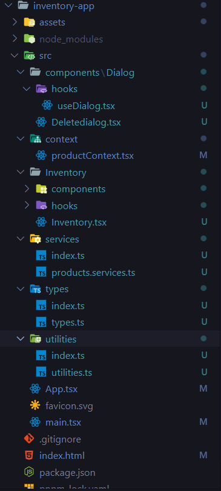
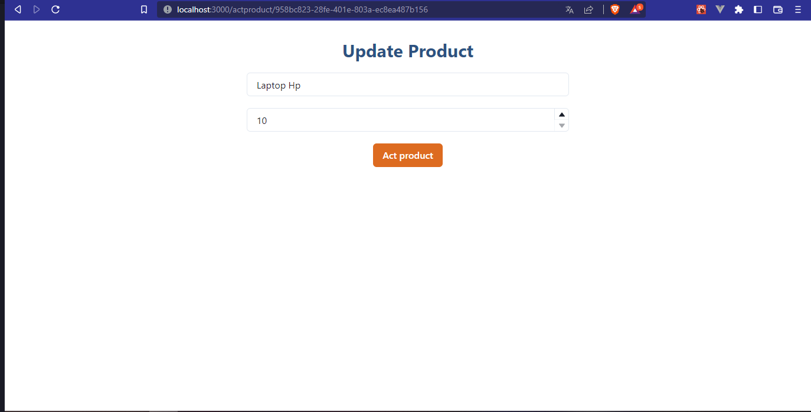
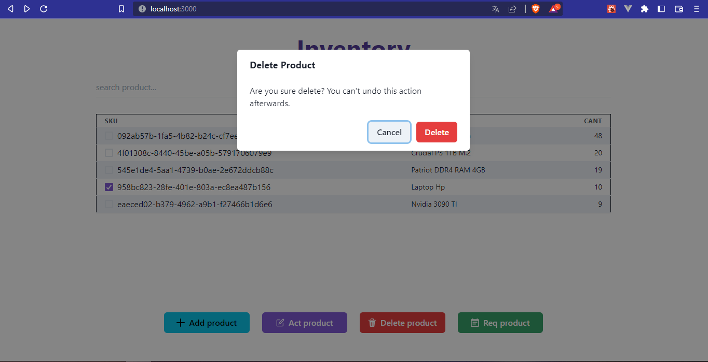
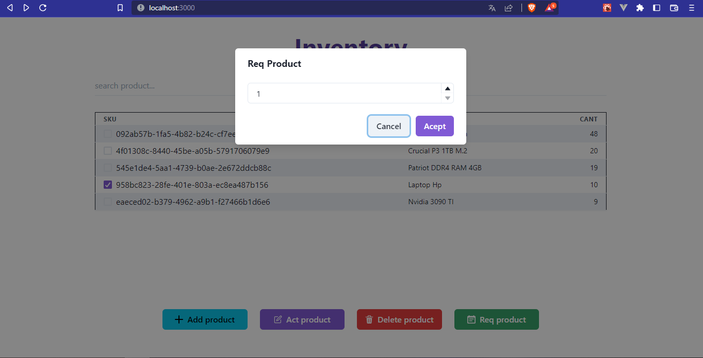

# Inventory App V2

Este proyecto fue desarrollado  con [Vite](https://vitejs.dev/) , [Chakra UI ](https://chakra-ui.com/) y
[Axios](https://axios-http.com/es/) para las solicitudes http.

## Descripcion 
App para administrar un inventario asi como poder agregar nuevos productos ,actualizar existentes eliminarlos y restar cantidad de su stock.

## Cambios 
se ha agregado typescript para tener un tipado de datos y se ha configurado cliente axios para optimizar las solicitudes http y se agrego respaldo del estado en localstorage.

## Estructura de carpetas 
Se sigue una arquitectura clean architecture en este caso la aplicación vive en la carpeta inventario. las demas carpetas tienen utilidades funciones y tipos que se pueden usar en cualquier parte de la aplicación.



- Hooks: custom hooks para optimizar funciones de componentes de la aplicación.

- Types: carpeta donde se declaran los tipos de dato que pueden usarse en toda la aplicación.

- Services: lugar donde se realiza la configuracion de Axios y las solicitudes http de la aplicación.

## Lista de productos 
Vista inicial del proyecto donde se muestran los productos registrados en la base de datos se cuenta con una barra de busqueda para buscar algun producto se puede realizar diferentes accione al dar click en los botones de la parte inferior.


## Nuevo producto 
Formulario para registrar un nuevo producto no es necesario proportionar un sku.


## Actualizar Producto
Para actualizar solo hay que seleccionar un producto en la lista y este nos dara un formulario con los datos del producto solo es necesario hacer cambios y dar click en act product.




## Eliminar Producto

Para eliminar hay que seleccionar el producto y dar click en el boton delete y confirmar en la ventana de dialogo.





## Restar Stock Producto

Para restar el producto solo hay que seleccionarlo y dar click en el boton req product y seleccionar la cantidad y confirmar cambios en la ventana de dialogo.




## Incializar servidor de desarrollo

```node
 npm i o pnpm i
 npm run dev o pnpm run dev
```