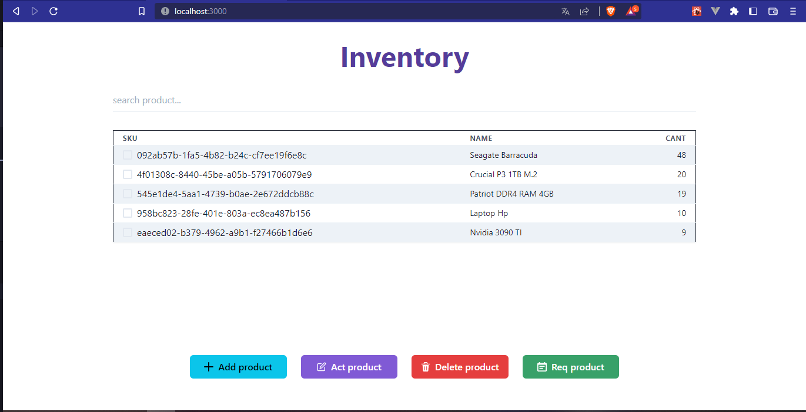

# Inventory App

Este proyecto fue desarrollado  con [Vite](https://vitejs.dev/) y [Chakra UI ](https://chakra-ui.com/) .

# Descripcion 
App para adminsitrar un inventario para realizar las diversas operaciones hay que seleccionar el producto
una vez seleccionado puede elegir la accion a implementar.

Lista de productos

Nuevo producto 

## Notas 

agregar requision de mercancia 
buscar requisiciones 